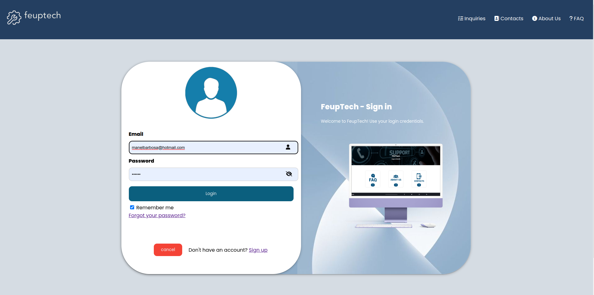
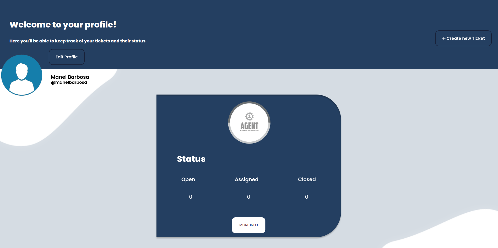
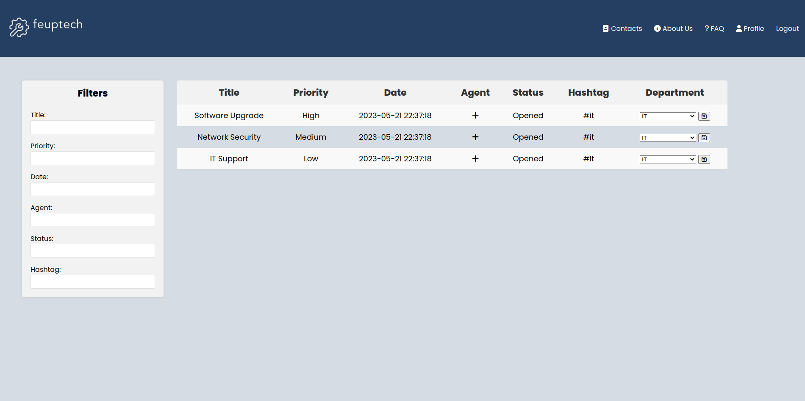
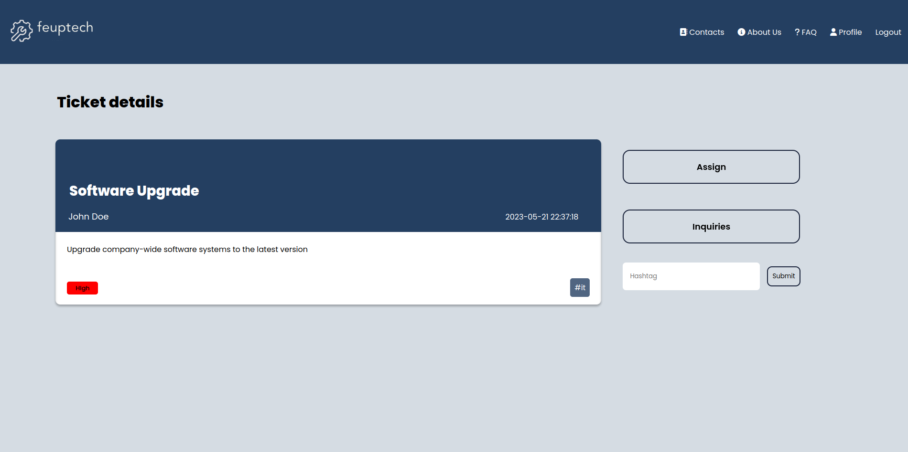
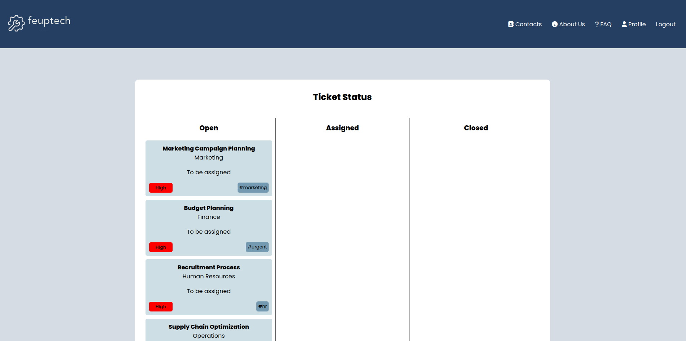

# FEUPTech Trouble Tickets Management System

## Instructions to start the project

```
git clone git@github.com:FEUP-LTW-2023/project-ltw11g01.git
cd project-ltw11g01
php -S localhost:9000
```
Check the project in:
[http://localhost:9000/](http://localhost:9000/)

### Every time you want to repopulate the original database:

```
cd database
rm -f database.db
sqlite3 database.db < database.sql
```

Note: The original database is already populated when you clone the project


### Screenshots















---

Project developed as part of the Web Languages and Technologies course during the academic year 2022/2023. Done by Davide Teixeira, Inês Silva and Linda Inês Rodrigues (up202005545@edu.fc.up.pt)


